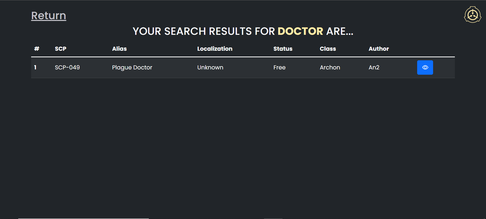
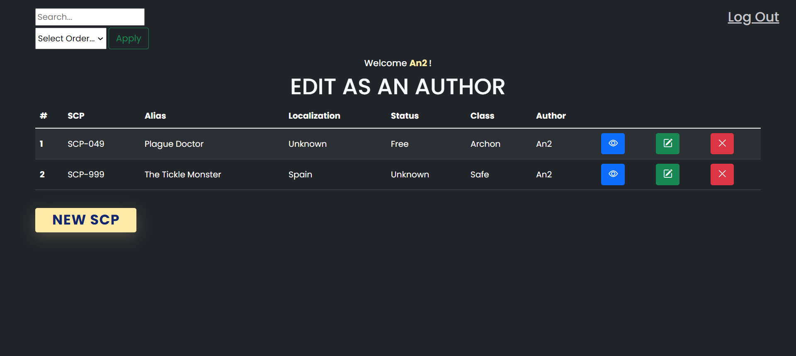
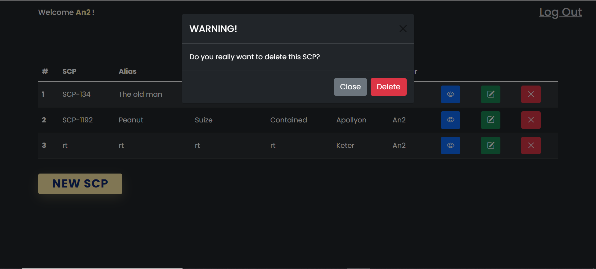

# TheSCPFoundation-CRUD
A CRUD about The SCP Foundation made with Java, SQL, HTML, CSS and JS. 

To get into context, The SCP Foundation ("**Secure, Contain and Protect**") is a **fictional secret organization** documented by the collaborative writing wiki project of the same name. The foundation is responsible for **capturing and containing** various paranormal, supernatural, and other mysterious phenomena unexplained by mainstream science (known as "**anomalies**" or "**SCPs**"), while also **keeping their existence hidden from the rest of global human society**.
Many people contribute in social media with different stories about the SCP Foundation and their different anomalies, creating unique, science-fiction and horror stories connected into the same universe.

So what i wanted to do is giving them a place to **add, delete or modify their own stories**, all in the same website using this CRUD.

## INDEX: 
1. [Database Used](#database-used)
2. [Admin and Users](#admin-and-users-added)
3. [Screenshots](#screenshots)

## DATABASE USED

***NOTE:*** *To execute this NB Project, you must import [this file](https://github.com/DavidAntunezPerez/TheSCPFoundation-CRUD/blob/master/sql/scp_foundation_crud.sql) as DataBase*

## ADMIN AND USERS ADDED
Importing the database, you will have these users:
- User: An2 / Password: 123
- User: User1 / Password: user
- Admin: root / Password: root

***NOTE***: Using root user, you will be able to access and manipulate all the data inside the database. 
(The name of the database must be: scp_foundation_crud )

From default, there are also 3 SCP added, 2 of them from the user An2 and the other one from User1.

## SCREENSHOTS
### **Index:**

### **Access as a Reader:**

### **Log In & Sign Up:**

### **Access as an author:**

### **Access as root:**

### **DELETE:**

### **INSERT:**

### **EDIT:**

